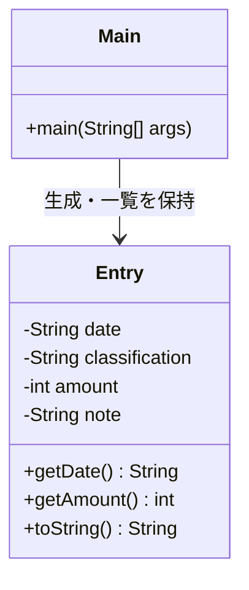
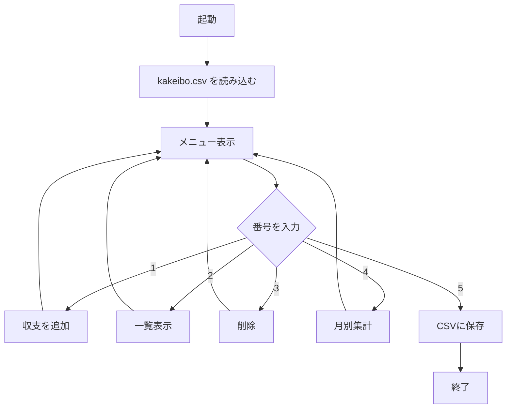

# 家計簿アプリ kakeibo

## 概要

Javaで作った、コマンドラインで動く家計簿アプリです。

## 開発の経緯・動機

- 毎月の収支を手帳で管理するのが面倒だったので、自分用に作りたかった

- Javaの基本（クラス・配列・ファイル入出力）を一通り使ってみたかった

## 機能一覧
- 収支の追加
- 一覧表示
- 削除（番号を指定）
- 月別集計（収入・支出・差引）
- CSVへの保存 / 起動時の読み込み

## 使い方
1. 起動するとメニューが表示される
2. 番号を入力して機能を選ぶ
3. 5を選ぶと CSV に保存して終了する

## 実行方法
（Eclipse: Run As > Java Application / コマンド: java -cp bin Main）

## 工夫した点・学んだこと
- データを消さないように、保存と読み込みの両方を実装した
- ファイル入出力（PrintWriter / Scanner）と例外処理を学んだ
- 配列は0始まりなので、表示番号とのズレに注意した

## 開発環境
- Java（JDK 17）
- Eclipse

## システム構成

### クラス構成

### 処理の流れ

## スキルシート

### 習得した技術（基礎レベル）
| 分野 | 内容 |
|---|---|
| プログラミング言語 | C言語、Java（基本文法・クラス・配列・ファイル入出力） |
| Web | HTML |
| ネットワーク | 基礎 |
| データベース | 基礎（SQL） |
| 開発環境 | Eclipse、Git / GitHub |

### 今後学習予定（ポリテクセンター）
- PHP
- JSP / サーブレット
- Spring Framework
- JavaScript
- Linux

### 資格
- 取得済み: なし
- 目標: Oracle Java Silver（取得に向けて学習中）

### 制作物
| 種別 | 作品 | 使用技術 |
|---|---|---|
| コンソールアプリ | 家計簿アプリ kakeibo | Java |